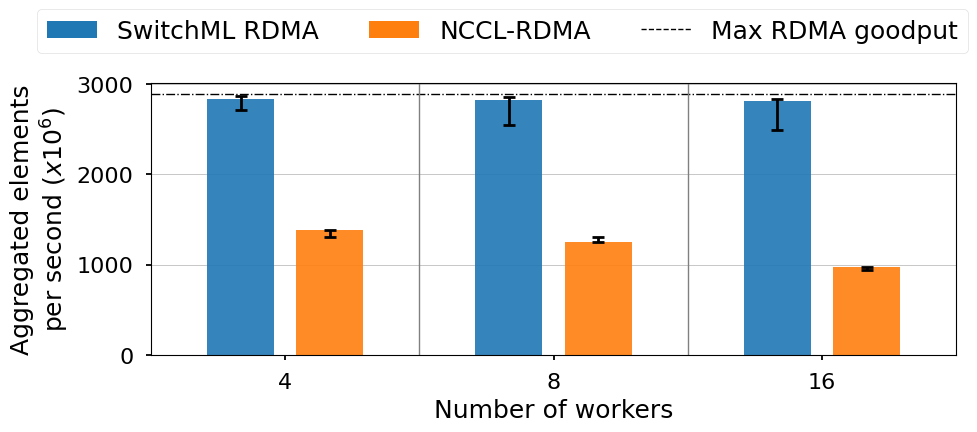

# SwitchML: Switch-Based Training Acceleration for Machine Learning

SwitchML accelerates the all-reduce communication primitive commonly used by distributed Machine Learning frameworks. It uses a programmable switch dataplane to perform in-network computation, reducing the volume of exchanged data by aggregating vectors (e.g., model updates) from  multiple  workers  in  the  network.  It provides an end-host library that can be integrated with ML frameworks to provide an efficient solution that speeds up training for a number of real-world benchmark models.

The switch hardware is programmed with a [P4 program](dev_root/switch_p4) for the [Tofino Native Architecture (TNA)](https://github.com/barefootnetworks/Open-Tofino) and managed at runtime through a [Python controller](dev_root/switch_controller) using BFRuntime. The [end-host library](dev_root/client_lib) provides simple APIs to perform all-reduce operations using different transport protocols. We currently support UDP through DPDK and RDMA UC. The library has already been integrated with ML frameworks as a [NCCL plugin](dev_root/frameworks_integration/nccl_plugin).

## Getting started
To run SwitchML you need to:
- compile the P4 program and deploy it on the switch (see README file in the [P4 code folder](dev_root/switch_p4)
- run the Python controller (see README file in the [controller folder](dev_root/switch_controller)
- compile and run the end-host program using the end-host library (see README file in the [library folder](dev_root/client_lib)

The [example](dev_root/example) folder provides a simple program that shows how to use the APIs. 

## Repo organization
This repository is organized as follows:

```
docs: project documentation
dev_root:
  ┣ switch_p4: P4 code for TNA
  ┣ switch_controller: controller program
  ┣ client_lib: end-host library
  ┣ examples: set of example programs
  ┣ frameworks_integration: code to integrate with ML frameworks
  ┗ third_party: third party software
```

## Testing
The [benchmarks folder](dev_root/benchmarks) contains a benchmarks program that we used to measure SwitchML performances. 
In our experiments (see benchmark folder for details) we observed a more than 2x speedup over NCCL when using RDMA. Moreover, differently from ring all-reduce, with SwitchML performance are constant with any number of workers.



## Publication

> Scaling Distributed Machine Learning with In-Network Aggregation
> A. Sapio, M. Canini, C.-Y. Ho, J. Nelson, P. Kalnis, C. Kim, A. Krishnamurthy, M. Moshref, D. R. K. Ports, P. Richtarik.
> In Proceedings of NSDI’21, Apr 2021.

## Contributing
This project welcomes contributions and suggestions.
To learn more about making a contribution to SwitchML, please see our [Contribution](CONTRIBUTING.md) page.

## The Team
SwitchML is a project driven by the P4.org community and is currently  maintained by Amedeo Sapio, Omar Alama, Marco Canini, Jacob Nelson, ... 

## License
SwitchML is released with an Apache License 2.0, as found in the [LICENSE](LICENSE) file.
